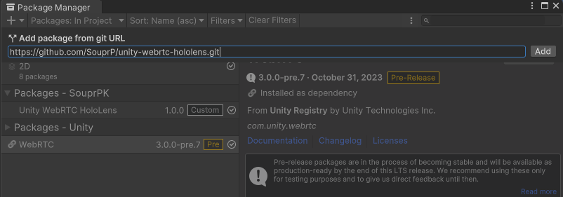

# unity-webrtc-hololens

WebRTC connection handler between Microsoft Hololens and a custom python SFU.

# Requirements

This page lists the Unity version and platform that the package supports.

## Unity Version

This version of the package has been tested on the following versions
of Unity editor:

- **Unity 2022.3**
- **Unity 2023.1**

## Other packages

This package requires the following additional packages:

- **WebRTC 3.0.0-pre.7**

# Installing package

Select `Window/Package Manager` in the menu bar.


Click `+` button and select `Add package from git URL...`.


Input the string below to the input field.

```
https://github.com/SouprP/unity-webrtc-hololens.git
```

Click `Add` button, and Package Manager will start installing the package.



# Usage

### Creating a WebRTC client

There are multiple ways of creating a WebRTC client

```csharp
// Normal creation
WebRTCClient _client new WebRTCClient("localhost", 8765
    , "S1", "unity_client_p1", "chat");

// Creation using setters
WebRTCClient _client_setters = new WebRTCClient();
_client_setters.SetServer("localhost")
_client_setters.SetPort(8765)
_client_setters.SetSessionId("S1")
_client_setters.SetPeerId("unity_client_p1")
_client_setters.SetChannel("chat")

// Creation using builder
WebRTCClient _client_builder = new WebRTCClientBuilder()
        .SetServer("localhost")
        .SetPort(8765)
        .SetSessionId("S1")
        .SetPeerId("unity_client_p1")
        .SetChannel("chat")
        .Build();
```

### Initialization

Initializing connection between client and server and setting up 
message receiving

```csharp
// Initialization and event handler
_client.InitClient();
_client.OnDataReceived += OnMessage;

void OnMessage(byte[] data)
{
    string message = Encoding.UTF8.GetString(data);
    Debug.Log("Message received: " + message);
}
```

### Sending data

When the connection between server and client is established, 
a data channel is created, and it's possible to send messages
with `string` and `byte[]` data types.

```csharp
void Update()
{
    if(Input.GetKeyDown(KeyCode.Space))
        _client.Send("Hello World");
}
```

### Client closing

When finished, `Close` method must be called for the client in
order to notify the server that you want to leave the session and
end a WebRTC connection.

```csharp
private void OnDestroy()
{
    _client.Close();
}
```

### Example usage

```csharp
using System;
using System.Text;
using UnityEngine;

public class Example : MonoBehaviour
{
    WebRTCClient _client;
    void Start()
    {
        // Unique random peerId
        string peerId = Guid.NewGuid().ToString();
        
        _client = new WebRTCClientBuilder()
            .SetServer("localhost")
            .SetPort(8765)
            .SetSessionId("S1")
            .SetPeerId(peerId)
            .SetChannel("chat")
            .Build();
        
        _client.InitClient();
        _client.OnDataReceived += OnMessage;
    }

    void Update()
    {
        if(Input.GetKeyDown(KeyCode.Space))
            _client.Send("Unity client message on key press.");
    }

    void OnMessage(byte[] data)
    {
        string message = Encoding.UTF8.GetString(data);
        Debug.Log("Message received: " + message);
    }

    private void OnDestroy()
    {
        _client.Close();
    }
}

```
